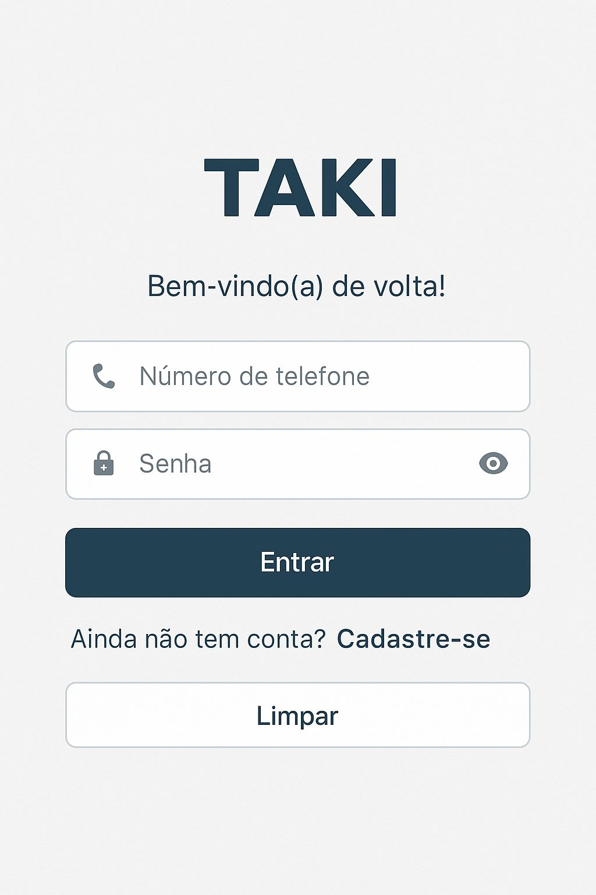
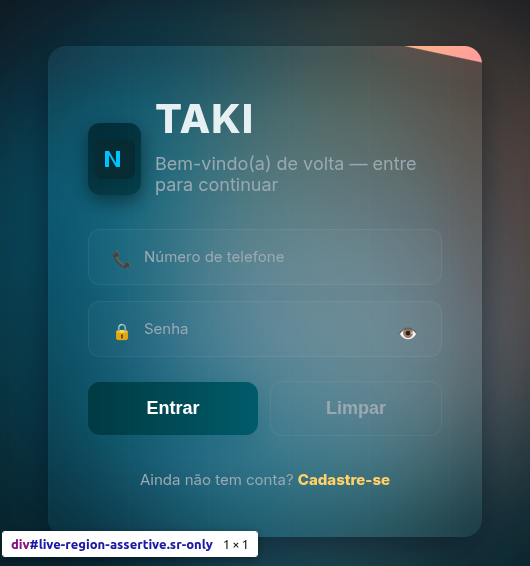

## Descrição das Mudanças
> Explicação concisa do que foi alterado e porquê

### Relacionado a Issue
Closes #123 

### Tipo de Mudança
- [ ] Correção de bug (non-breaking change)
- [ ] Nova feature (non-breaking change)
- [ ] Breaking change (mudança que quebra compatibilidade)
- [ ] Refatoração (sem alteração funcional)

### Checklist
- [ ] Meu código segue as guidelines do projeto
- [ ] Adicionei testes relevantes
- [ ] Executei testes localmente
- [ ] Atualizei a documentação
- [ ] Adicionei comentários em áreas complexas

### Testes Realizados
Descrição dos testes executados para validar as mudanças

### Capturas de Tela (se aplicável)
Antes | Depois
:-------------------------:|:-------------------------:
**Tela de Login**  |  **Tela de Login Atualizada**
 | 

### Notas Adicionais
Qualquer informação adicional que os revisores precisem saber